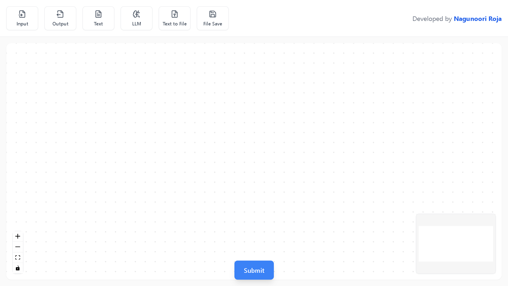
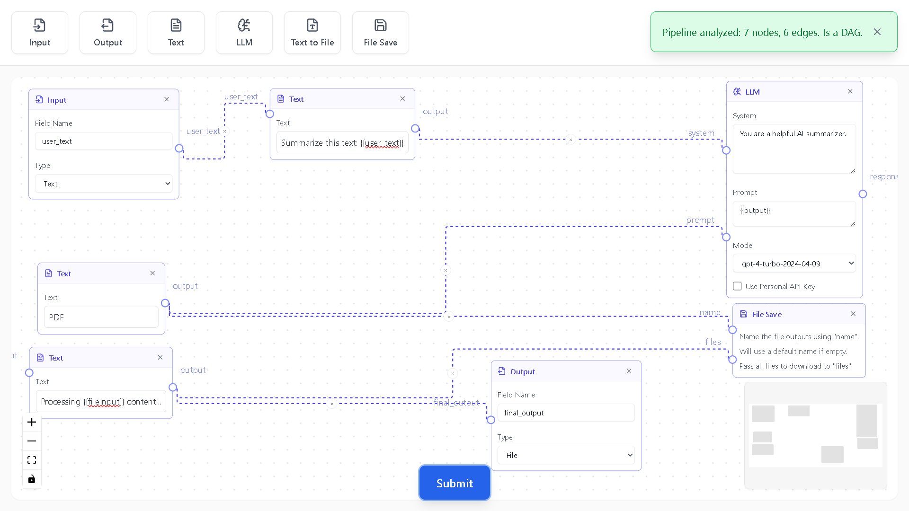

# 🧩 Dynamic Diagram Flow

## 🖼️ Screenshots

### 1️⃣ Empty Canvas


### 2️⃣ Completed Flow



A visual pipeline builder built with **React**, **React Flow**, **Zustand**, and **Tailwind CSS** — allowing users to design, connect, and validate data or AI processing flows.

🌐 **Live Demo:** [https://dynamic-diagram-flow-react.netlify.app/](https://dynamic-diagram-flow-react.netlify.app/)  
📦 **Repository:** [https://github.com/rojanagunoori/dynamic-diagram-flow](https://github.com/rojanagunoori/dynamic-diagram-flow)

---

## 🚀 Overview

Dynamic Diagram Flow enables drag-and-drop creation of connected processing nodes, such as **Text**, **LLM**, **File**, and **Output** nodes.  
Each node can have editable settings, and you can link outputs to inputs to build a dynamic data pipeline.  

You can also validate your flow to check if it forms a **Directed Acyclic Graph (DAG)** before execution.

---

## ✨ Features

✅ **Drag & Drop Nodes** — Build workflows easily using React Flow.  
✅ **Custom Node Types:**
- **TextNode:** Write text and dynamically extract variables (`{{variable}}`).
- **LLMNode:** Connect to GPT models, customize system & prompt inputs.
- **OutputNode:** Define output field name & type.
- **TextToFileNode:** Convert text to downloadable files (PDF, DOCX, TXT).
- **FileSaveNode:** Save files with custom names.
- **EditableDiv:** Inline text editing with variable detection.

✅ **Pipeline Validation:**  
Checks if your flow is a valid **DAG (Directed Acyclic Graph)** using a depth-first search algorithm.  

✅ **State Management:**  
Uses **Zustand** for managing nodes, edges, and updates efficiently.

✅ **Modern UI:**  
Built with **Tailwind CSS**, **Lucide React Icons**, and smooth shadows for an elegant design.

---

## 🛠️ Tech Stack

- **React 18+**
- **React Flow** — node-based editor framework
- **Zustand** — state management
- **Tailwind CSS** — styling
- **Lucide-react** — icons

---

## 📂 Project Structure
```bash
dynamic-diagram-flow/
│
├── public/ # Static assets
├── src/
│ ├── components/
│ │ └── EditableDiv.js
│ ├── edges/
│ ├── pages/
│ │ ├── nodes/ # Custom node components
│ │ ├── utils/ # Utility functions (e.g., isDAG)
│ │ ├── PipelineUI.js
│ │ ├── PipelineToolbar.js
│ │ ├── SubmitButton.js
│ │ └── store.js
│ ├── App.js
│ └── index.js
│
├── package.json
├── tailwind.config.js
├── postcss.config.js
└── README.md
```

---

## ⚙️ Installation & Setup

### Prerequisites
- Node.js 16+
- npm or yarn

### Install dependencies
```bash
npm install
```
### Run locally
```bash
npm start
```
Runs the app in development mode on http://localhost:3000

### Build for production
```bash
npm run build
```
### 🧠 How It Works
1. **Drag** a node (e.g., Text, LLM, Output) from the toolbar.

2. **Connect** handles by dragging between nodes.

3. **Edit** content dynamically inside nodes.

4. **Validate** your pipeline using the **Submit** button — checks if your graph is a valid DAG.

5. **Extend** the flow by adding new node types inside src/pages/nodes/.

## 🧩 Example Nodes
| Node                  | Purpose                                      |
| --------------------- | -------------------------------------------- |
| 📝 **TextNode**       | Create text templates using `{{variables}}`. |
| 🧠 **LLMNode**        | Generate AI responses using GPT models.      |
| 📄 **TextToFileNode** | Convert generated text to a file format.     |
| 💾 **FileSaveNode**   | Save one or more files to local storage.     |
| 🔚 **OutputNode**     | Display or define output of the pipeline.    |


## ✅ Validation Logic
Your graph is validated using a simple DFS-based cycle detection algorithm (isDAG.js).
If the graph contains cycles, the UI displays an error alert.

## 🧑‍💻 Contributing
1. Fork the repository

2. Create a feature branch
```bash
git checkout -b feature/my-new-node
```
3. Commit changes and push

4. Submit a Pull Request 🚀

## 🪪 License
This project is licensed under the MIT License.

## 👩‍💻 Author
Rojanagunoori Roja

📧 Email: rojanagunoori@gmail.com

🌐 Portfolio: https://portfolio-roja.netlify.app/